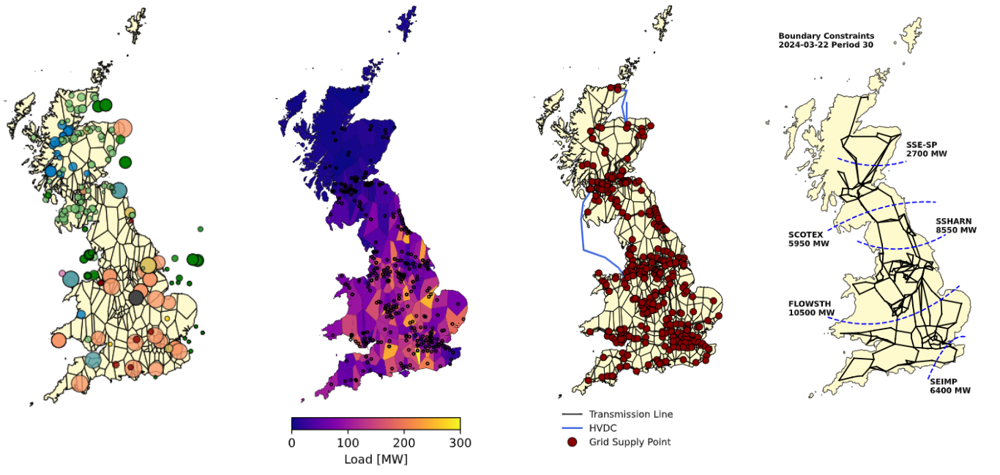
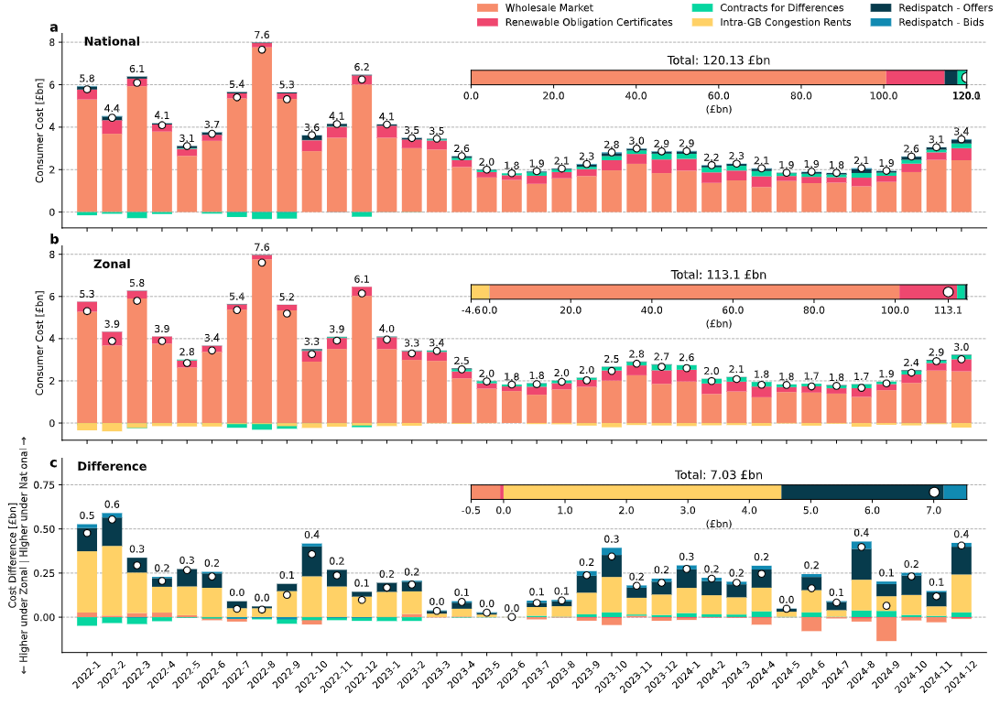

### GBPower: A unit-level electricity market model for Great Britain

A PyPSA-based model of the Great British electricity market that, so far, has been used to analyse the effect a zonal market would have had in GB if it had been implemented during 2022, 2023 and 2024:

**[Risk and Reward of Transitioning from a National to a Zonal Electricity Market in Great Britain](https://arxiv.org/abs/2506.04107)**



#### Model Features:
- Models national, and counterfactual 6-zonal and nodal (consisting of 300 zones) wholesale and balancing markets.
- Simulates historical days in 48 settlement periods each
- Works with a unit-level resolution
- Is *data-driven* and for each settlement periods inserts data from ELEXON, ENTSO-E and NESO APIs:
    - Physical Notifications (PN) or Maximum Export Limit (MEL) for each unit 
    - Day-Ahead wholesale prices to tune the short-run marginal cost of thermal generators to achieve a realistic price curve
    - Day-Ahead price of European countries for interconnectors
    - Interconnector availability
    - Unit-level congestion management cost
    - Thermal constraints across grid bottlenecks SSE-SP, SCOTEX, SSHARN, FLOWSTH, SEIMP
    - Curtailment volumes
- Calibrates line capacities each day such that national market balancing volumes match between model and real system
- Runs a wholesale market simulation, inserts the resulting interconnector and storage schedules into a nodal model, reruns the simulation to find the configuration that is compliant with transmission constraints and from that estimates balancing volumes and cost
- In post-processing estimates renewable's units revenues from Renewable Obligation (RO) and Contracts for Differences (CfD) subsidy schemes
- Is, in structure, heavily inspired by the European-level model **[PyPSA-Eur](https://github.com/pypsa/pypsa-eur)**
- Has minimal computational overhead and easily runs on any machine using open-source solvers
- Summarises system costs in terms of wholesale costs, CfD and RO payments, congestion rent, balancing bids and offers



- For a more elaborate description, please find **[the paper](https://arxiv.org/abs/2506.04107)**.

#### Installation

- Install the environment `mamba env create -f envs/environment.yaml`. Use `conda` instaed of `mamba` if preferred.
- Activate the environment `conda activate gbpower`.
- Create a file `touch scripts/_tokens.py` and insert your **[ENTSO-E API key](https://uat-transparency.entsoe.eu/content/static_content/Static%20content/web%20api/how_to_get_security_token.html)** following the syntax `ENTSOE_API_KEY = '...'` .
- Run an example day `2024-03-21` (which has substantial curtailment) and inspect code and output.
```
snakemake -call --configfile config.yaml -- results/2024-03-21/system_cost_summary_flex.csv
```

#### Reproducing the paper's results

- The model needs to be run for every day of 2022, 2023 and 2024 for instance via

```
import os
import pandas as pd

template = 'snakemake -call --configfile config.yaml -- frontend/{}/dispatch_flex.csv'

for day in pd.date_range('2022-01-01', '2024-12-31', freq='d').strftime('%Y-%m-%d'):
    os.system(template.format(day))
```

- Create a summary dictionary `mkdir summaries`.
- Next, run the script `gather_all.py` from the root directory.
- After that, the files in `notebooks/` should be functional and build the figures from the paper.


#### Potential Future Enhancements

- The model has weaknesses (see Limitations section in the paper), but could be improved for instance through these additions
- Difficulty level: 
    - 🐮 Easy
    - 🦂 Moderate
    - 🐉 Very hard (I think worthy of a research article)

- 🐮: **Clean-up postprocessing**; The `rules` in `rules/postprocess.smk` grew dynamically with the requirements of the paper, and are therefore in a chaotic state, they could be cleaned up.
- 🐮: **Remove `ic` wildcard**; The `ic` wildcard can take the values `flex` or `static`, but the latter is redundant, and therefore the wildcard could be removed.
- 🦂: **Make European spot prices elastic**; Currently, interconnector scheduling has no effect on the wholesale price of other countries. However, especially for smaller markets such as Belgium or the Netherlands, this is an issue because these markets are rather small, and interconnectors should affect their spot-price in a non-negligible way. One way to implement this would be the **[EuroMod paper](https://www.sciencedirect.com/science/article/pii/S0140988324000513)**.
- 🐉: **Explicit Balancing Market**; Elexon offers enough data to assign potential balancing volumes and prices on a unit level. This could be used to implement a more detailed balancing market, instead of the current model which uses wholesale prices in the balancing simulation.
- 🐉: **Implement Zonal Market with AC Power Flow**; The current model works in a full DC-approximation to facilitate representing a zonal market design.


#### Citation:
If you use the model in your research, please cite it via the article
```
@article{franken2025risk,
  title={Risk and Reward of Transitioning from a National to a Zonal Electricity Market in Great Britain},
  author={Franken, Lukas and Lyden, Andrew and Friedrich, Daniel},
  journal={arXiv preprint arXiv:2506.04107},
  year={2025}
}
```


#### Questions
- Please feel free to reach out to lukas.franken@ed.ac.uk


